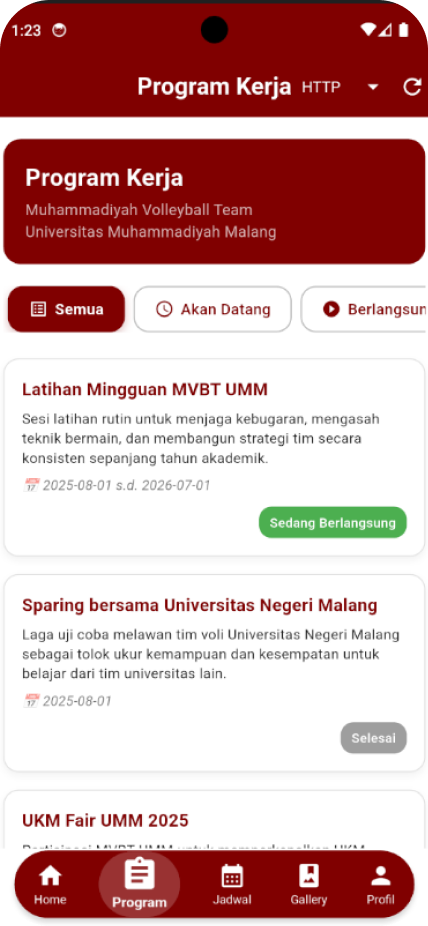
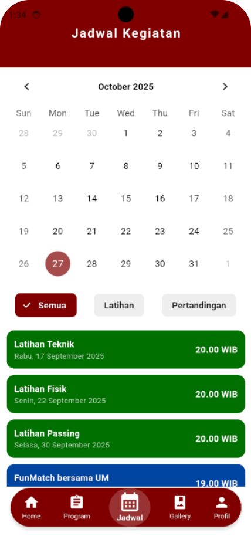

# 🏐 Aplikasi Muhammadiyah Volleyball Team - Universitas Muhammadiyah Malang

Aplikasi ini dikembangkan untuk **memanajemen kegiatan tim voli Universitas Muhammadiyah Malang (UMM)**.  
Dibangun menggunakan **Flutter** untuk pengelolaan **program kerja** dan **jadwal kegiatan**.

---
## 📷 Preview Aplikasi

### 📋 Halaman Program Kerja
Menampilkan daftar program kerja lengkap beserta status dan deskripsi.

### 🗓️ Halaman Jadwal Kegiatan
Menampilkan kalender berisi jadwal latihan dan pertandingan.

---

## 🎯 Tujuan Aplikasi
Aplikasi ini bertujuan untuk:
- Memudahkan **pengelolaan dan pendataan kegiatan voli** di lingkungan Universitas Muhammadiyah Malang.  
- Menyediakan **informasi program kerja, jadwal latihan, dan pertandingan** secara terpusat dan mudah diakses.  
- Meningkatkan **efisiensi komunikasi dan koordinasi** antar anggota tim voli.

---

## 🚀 Fitur Utama

### 📋 1. Program Kerja
- Menampilkan daftar **program kerja tim voli** yang sedang atau akan dilaksanakan.  
- Setiap program menampilkan **judul, deskripsi, tanggal pelaksanaan, status, dan kondisi keaktifan**.  
- Status kegiatan ditentukan otomatis berdasarkan tanggal atau status aktif (*Akan Datang*, *Sedang Berlangsung*, *Selesai*).  
- Data diambil dari **API** menggunakan dua metode: **HTTP** dan **Dio**.

### 🗓️ 2. Jadwal Kegiatan
- Menyediakan menu **kalender kegiatan** yang menampilkan jadwal **latihan dan pertandingan** tim voli.  
- Pengguna dapat melihat detail kegiatan berdasarkan tanggal.  
- Membantu tim dalam **mengatur waktu latihan dan event pertandingan** agar lebih terorganisir.

---

